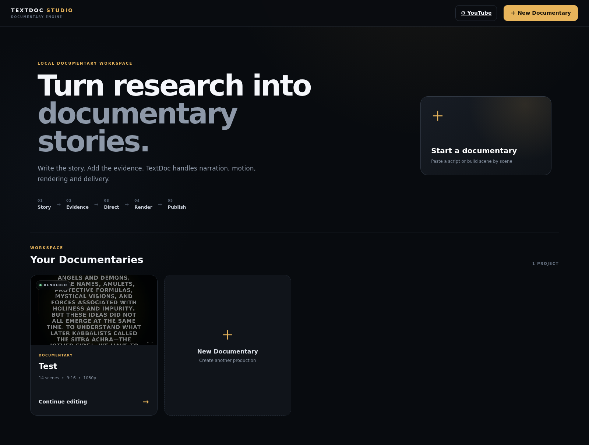
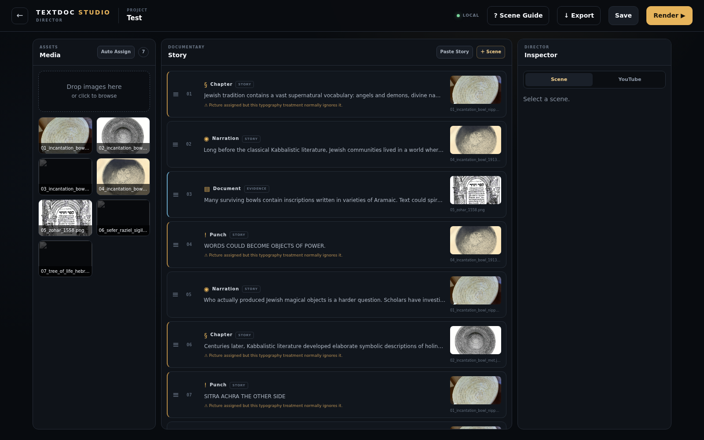
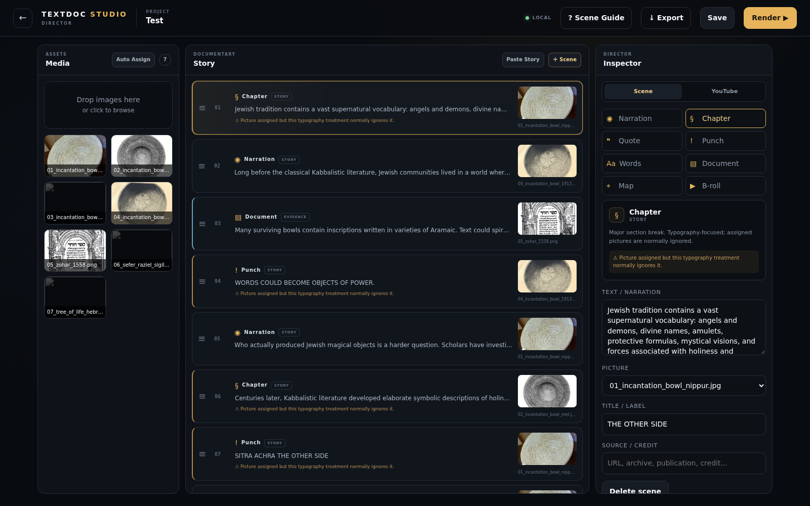
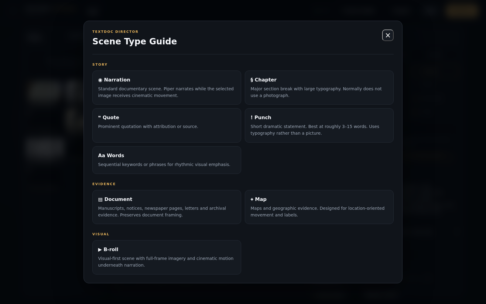
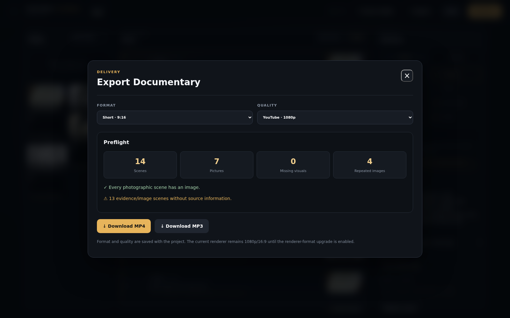
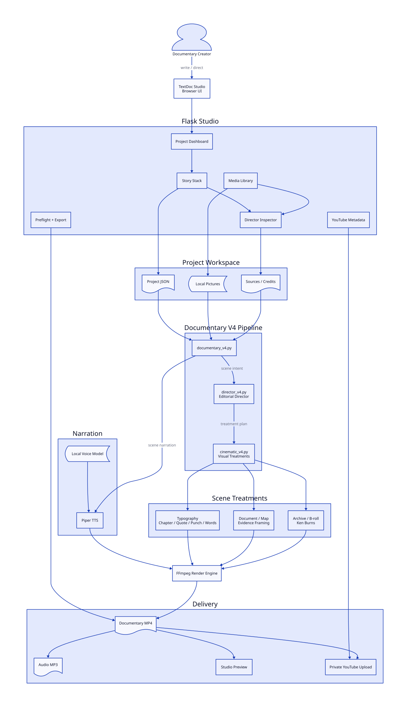

# TextDoc Studio

[](https://github.com/iamrichmack111/textdoc-studio/actions/workflows/ci.yml)
[](https://github.com/iamrichmack111/textdoc-studio/actions/workflows/container.yml)


**Make the story. Not the timeline.**

TextDoc Studio is a local-first documentary production workspace. Build a stack of semantic scenes, assign local evidence and imagery, and let Piper + FFmpeg handle narration and mechanical assembly.

## Features

- Flask project dashboard and three-column documentary workspace
- bulk story import, draggable scene ordering, local media library
- Narration, Chapter, Quote, Punch, Words, Document, Map, and B-roll
- Piper local narration; V4 cinematic/document/graphic rendering
- progress reporting and restart-render support
- browser video preview; MP4 and MP3 downloads
- export preflight for missing/repeated visuals and source metadata
- YouTube metadata plus private OAuth upload
- Playwright screenshot and narrated-demo automation
- Docker/Compose deployment, CI, and GHCR container CD

## Architecture

```text
Browser -> Flask Studio -> Story Stack + Media -> Documentary V4
                                             -> Director V4
                                             -> Piper
                                             -> Cinematic V4 + FFmpeg
                                             -> output.mp4
```

See [Architecture](docs/ARCHITECTURE.md) and [Scene Types](docs/SCENE_TYPES.md).

## Ubuntu installation

```bash
sudo apt update
sudo apt install -y python3 python3-venv python3-pip ffmpeg git
git clone git@github.com:iamrichmack111/textdoc-studio.git
cd textdoc-studio
./install.sh
```

Put a compatible Piper `.onnx` model and its JSON metadata in `voices/`, then:

```bash
./run-studio.sh
```

Open `http://SERVER-IP:8014/`.

## Docker

```bash
mkdir -p studio-data voices
cp /path/to/voice.onnx voices/
cp /path/to/voice.onnx.json voices/
cp .env.example .env
docker compose up -d --build
docker compose ps
```

Project data persists under `studio-data/`; voices are mounted read-only and are not baked into the image.

## Build a documentary

Create a project, choose **Paste narration**, and import tagged blocks:

```text
[CHAPTER]
THE OTHER SIDE

[NARRATION]
The story begins here.

[DOCUMENT]
This surviving page provides evidence for the period.

[PUNCH]
WORDS COULD BECOME OBJECTS OF POWER.

[QUOTE]
"The other side."
SOURCE: Example attribution
```

Upload JPG/JPEG/PNG/WEBP media. Drag a picture onto a compatible scene or choose it in the Scene Inspector. Add source/credit metadata for archival material. Press **Render** to launch Documentary V4. **Restart Render** replaces a stale/active render when possible. When complete, preview in Studio or use **Export** for MP4 video and MP3 audio.

## Scene guide

| Scene | Best use | Picture? |
|---|---|---:|
| Narration | Main explanatory prose | Yes |
| Chapter | Major section transition | Usually no |
| Quote | Attributed quotation | Optional |
| Punch | 3–15 word dramatic beat | Usually no |
| Words | Sequential concepts | No |
| Document | Manuscripts/notices/pages | Yes |
| Map | Geographic evidence | Yes |
| B-roll | Atmosphere/visual coverage | Yes |

The in-app **Scene Guide** explains the treatments in more detail.

## YouTube

Studio stores title, description, tags, category, chapters, and source information. OAuth is required for channel uploads; private visibility is the default. OAuth tokens and secrets are excluded from Git.

## Screenshots with Playwright

The repository includes screenshot automation rather than fabricated UI captures. After starting Studio and creating/opening a project, run:


```bash
./scripts/capture-screenshots.sh
```

It captures the real application to `media/screenshots/` including dashboard, editor, inspector, Scene Guide, and Export when a project is available.

## Narrated demo

With Studio running and a Piper voice installed:

```bash
TEXTDOC_PIPER_VOICE=voices/en_GB-alan-medium.onnx ./scripts/make-demo.sh
```

The script records real browser interaction with Playwright, synthesizes `media/demo/narration.txt` locally with Piper, normalizes narration, and creates `media/demo/textdoc-studio-demo.mp4`.

## CI/CD and container

`CI` runs Python/Flask smoke checks and a Docker build on pushes to `main` and pull requests. `Container` publishes to GitHub Container Registry on version tags. To publish a container release:

```bash
git tag v1.0.0
git push origin v1.0.0
```

The image is published as `ghcr.io/iamrichmack111/textdoc-studio`.

## Verify locally

```bash
./scripts/verify.sh
```

## First GitHub push over SSH

If `gh` is already authenticated:

```bash
chmod +x INSTALL_AND_PUSH.sh
./INSTALL_AND_PUSH.sh
```

The script creates/configures `iamrichmack111/textdoc-studio`, forces `origin` to `git@github.com:iamrichmack111/textdoc-studio.git`, sets the description/topics, commits, pushes `main`, and shows recent Actions runs.

## Security

`.gitignore` excludes project runtime data, OAuth tokens/credentials, Piper voices, recovery snapshots, virtual environments, and rendered audio/video. Review `git status` before public pushes when projects contain unpublished research or private media.

## Repository layout

```text
textdoc-studio/
├── textdoc/                 # CLI + V3/V4 renderers
├── textdoc_studio/          # Flask Studio
├── docs/                    # architecture + scene guide
├── scripts/                 # verify/screenshots/demo
├── .github/workflows/       # CI + container CD
├── Dockerfile
├── docker-compose.yml
├── install.sh
├── run-studio.sh
└── INSTALL_AND_PUSH.sh
```

---

## TextDoc Studio in Action

### Documentary Dashboard



### Story Workspace



### Director Inspector



### Scene Guide



### Export



## D2 Architecture



Editable source: `docs/architecture.d2`

```bash
d2 --layout=dagre docs/architecture.d2 docs/diagrams/textdoc-architecture.svg
```
